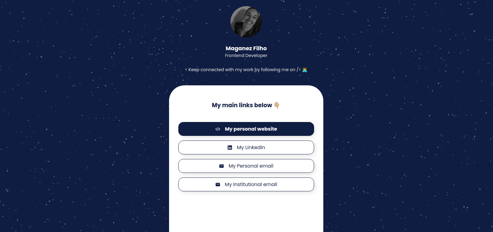
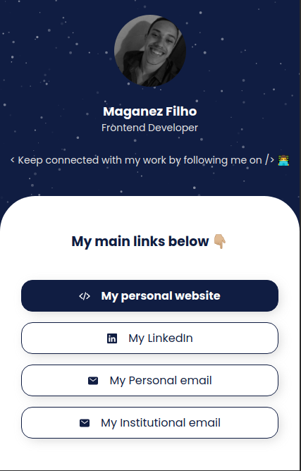

# 

   

  

  

  

  
  
  
  

> This is my 'My Linktree' project 🤗

The 'My Linktree' project. Built with ❤︎ by
<a href="https://github.com/maganezf">Maganez Filho</a> and
<a href="https://github.com/maganezf/my-linktree/graphs/contributors">
contributors
</a>

# 📌 Table of Contents

- [Live Website](#👀-live-website)
- [Technologies](#💻-technologies)
- [Ancillary sites at development](#💁-Ancillary-sites-at-development)
- [Object / Features](#🎯-object-/-features)
- [Found a bug? Missing a specific feature?](#🐛-issues)
- [Contributing](#🎉-contributing)
- [License](#📕-license)

<h2 align="left"> 🤩 Layout</h2>

  

    
  

  
  

    
  

   

# 👀 Live Website

👉 [Click to open Website here](https://my-linktree-maganezf.vercel.app/)

# 💻 Technologies

This project was made using the follow technologies:

- [HTML](https://developer.mozilla.org/en-US/docs/Web/HTML)
- [CSS](https://developer.mozilla.org/en-US/docs/Web/CSS)
- [SASS / SCSS](https://sass-lang.com/)
- [Javascript](https://www.javascript.com/)
- [Particles.js (Library)](https://github.com/VincentGarreau/particles.js/)
- [Vercel (hosting)](https://vercel.com/)

## 💁 Ancillary sites at development

- [Ion Icons](https://ionicons.com/)

# 🎯 Object / Features

- Join all my main links to share them more easily

# 🐛 Issues

Feel free to **file a new issue** with a respective title and description on the the [My Linktree](https://github.com/maganezf/my-linktree/issues) repository. If you already found a solution to your problem, **i would love to review your pull request**!

# 🎉 Contributing

First of all, thank you for being interested in helping out, your time is always appreciated in every way. 💯

Here's some tips:

- Check the [issues page](https://github.com/maganezf/my-linktree/issues) for already opened issues (or maybe even closed ones) that might already address your question/bug/feature request.
- Feature requests are welcomed! Provide some details on why it would be helpful for you and others, explain how you're using bull-board and if possible even some screenshots if you are willing to mock something!

Check out the [contributing](./CONTRIBUTING) page to see the best places to file issues, start discussions and begin contributing.

# 📕 License

Released in 2021 📕 License

Made with ❤︎ by [Maganez Filho](https://github.com/maganezf) 🚀.  
This project is under the [MIT license](./LICENSE).

Give a ⭐️ if this project helped you!
